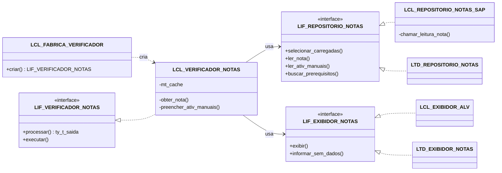
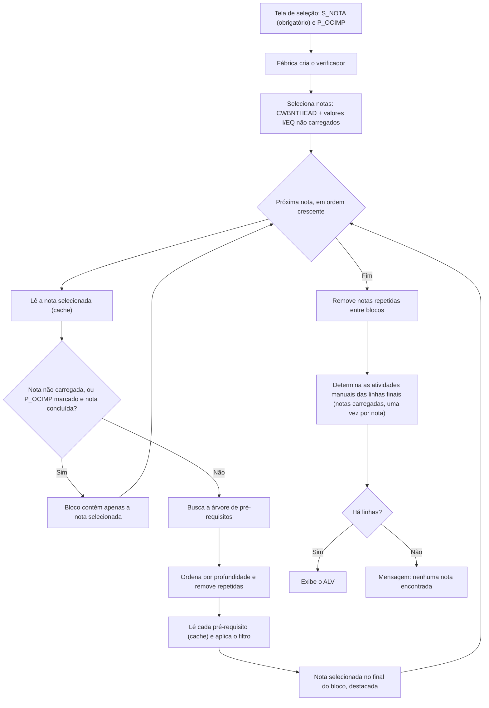
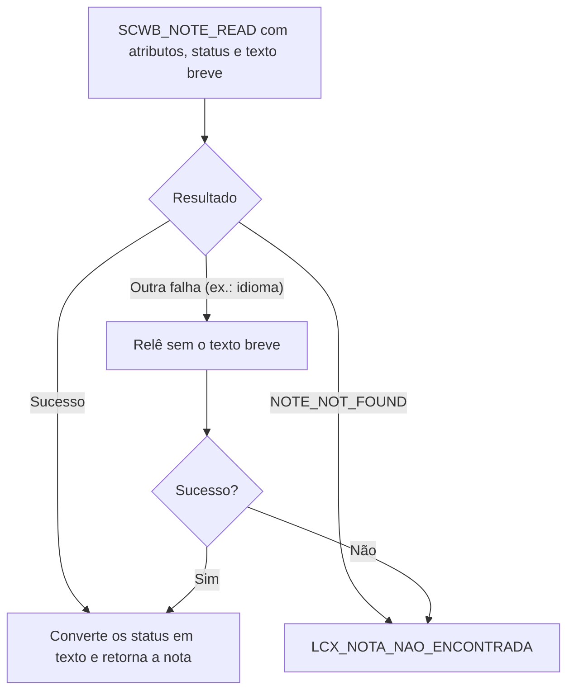
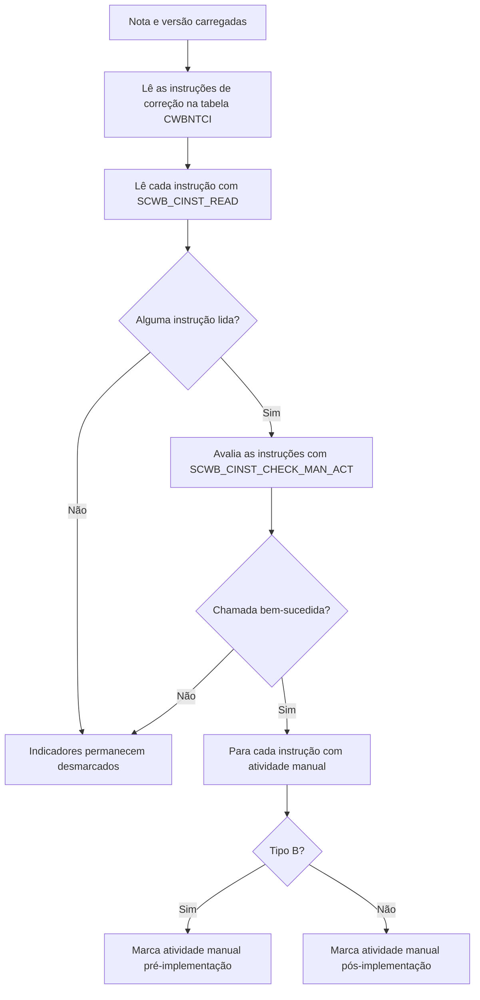

# Z_VERIF_NOTAS: Verificação de Notas SAP e da sua cadeia de pré-requisitos

Programa ABAP que recebe uma lista de Notas SAP e mostra, em uma única tela, todas as notas das quais cada uma depende, na ordem em que devem ser implementadas. Para cada nota, exibe o status atual no sistema e indica se ela exige atividades manuais antes ou depois da implementação.


 <!-- TODO: confirmar o status do projeto (ex.: em uso, estável, em desenvolvimento) -->
[](LICENSE)

## Sumário

- [Visão geral](#visão-geral)
- [Arquitetura](#arquitetura)
- [Tecnologias utilizadas](#tecnologias-utilizadas)
- [Estrutura do projeto](#estrutura-do-projeto)
- [Pré-requisitos e instalação](#pré-requisitos-e-instalação)
- [Exemplos de uso](#exemplos-de-uso)
- [Testes unitários](#testes-unitários)
- [Decisões técnicas](#decisões-técnicas)
- [Autor](#autor)
- [Licença](#licença)

## Visão geral

### Problema

Antes de implementar uma Nota SAP pela transação SNOTE, é preciso saber quais outras notas ela exige como pré-requisito. Essas dependências formam uma árvore: um pré-requisito pode ter seus próprios pré-requisitos. Verificar isso nota a nota é um trabalho manual, lento e sujeito a erro, principalmente quando várias notas são analisadas ao mesmo tempo. O mesmo vale para conferir o status de cada nota e descobrir quais exigem passos manuais, como ajustes de customizing ou criação de objetos no dicionário.

### Solução

O `Z_VERIF_NOTAS` automatiza essa análise. Para cada nota informada, o programa faz três coisas:

1. Busca a árvore completa de pré-requisitos, diretos e indiretos.
2. Ordena as notas pela ordem de implementação.
3. Exibe tudo em um relatório ALV com os status de implementação e de processamento, conforme a SNOTE, e com a indicação de atividades manuais pré e pós-implementação.

### Principais funcionalidades

- Seleção de notas por valores individuais, intervalos, padrões e exclusões.
- Inclusão de notas informadas que ainda não foram carregadas no sistema, identificadas como "Nota não carregada no sistema". Para essas notas, a árvore de pré-requisitos não é buscada.
- Busca da cadeia completa de pré-requisitos de cada nota.
- Ordenação pela ordem de implementação: notas mais profundas na árvore primeiro e, em caso de empate, pelo número da nota.
- **Indicação de atividades manuais**: duas colunas do relatório mostram, como caixa de seleção, se a nota possui atividades manuais antes da implementação (pré) ou depois dela (pós). Essa determinação, que é custosa, é feita apenas para as notas que efetivamente aparecem no relatório, uma única vez por nota.
- Filtro opcional para ocultar notas já concluídas. Se a própria nota selecionada estiver concluída, os pré-requisitos dela nem chegam a ser buscados.
- Remoção de notas repetidas, dentro de cada árvore e entre blocos de notas diferentes.
- **Leitura única por execução**: cada nota é lida no sistema uma só vez, mesmo quando é pré-requisito comum a vários blocos.
- Notas carregadas cujo texto breve não está disponível no idioma de logon continuam sendo exibidas normalmente, com a descrição em branco.
- Destaque em cor da nota selecionada, exibida como última linha do seu bloco.
- Layouts de exibição graváveis no ALV.
- Cobertura por 25 testes unitários (ABAP Unit), sem acesso a banco de dados nem à tela.

## Arquitetura

O programa separa regras de negócio, acesso a dados e apresentação por meio de interfaces. As dependências são montadas por uma fábrica (padrão Factory), que pode receber dublês de teste no lugar das implementações produtivas.

| Componente | Tipo | Responsabilidade |
|---|---|---|
| `LCL_FABRICA_VERIFICADOR` | Classe (abstrata, final) | Único ponto de criação do verificador. Injeta as dependências produtivas ou as recebidas por parâmetro. |
| `LIF_VERIFICADOR_NOTAS` / `LCL_VERIFICADOR_NOTAS` | Interface / Classe | Regras de negócio: seleção, ordenação, filtros, limpeza e decisão de quais notas têm as atividades manuais avaliadas. Mantém o cache de leitura das notas. `CREATE PRIVATE`, instanciada só pela fábrica. |
| `LIF_REPOSITORIO_NOTAS` / `LCL_REPOSITORIO_NOTAS_SAP` | Interface / Classe | Acesso aos dados: tabelas `CWBNTHEAD` e `CWBNTCI` e módulos de função da SNOTE, incluindo a determinação das atividades manuais. |
| `LIF_EXIBIDOR_NOTAS` / `LCL_EXIBIDOR_ALV` | Interface / Classe | Apresentação: ALV com `CL_SALV_TABLE`, layout gravável e mensagens de status. |
| `LCX_NOTA_NAO_ENCONTRADA` | Exceção (`CX_STATIC_CHECK`) | Sinaliza nota não carregada no sistema. |

### Relação entre os módulos



As classes `LTD_*` são dublês usados apenas nos testes unitários.

### Fluxo principal



### Leitura de uma nota

A leitura dos atributos e status, no método `ler_nota` do repositório, trata separadamente a ausência da nota e a falta do texto breve no idioma:



No verificador, o método `obter_nota` guarda o resultado de cada leitura (inclusive "não carregada"), de modo que a mesma nota nunca é lida duas vezes na mesma execução.

### Determinação das atividades manuais

O método `ler_ativ_manuais` do repositório é chamado pelo verificador somente para as linhas da tabela final, já filtrada e sem repetições, e somente para notas carregadas:



<!-- TODO: confirmar o significado funcional do tipo 'B' (tratado no código como atividade manual antes da implementação) -->
<!-- TODO: confirmar a disponibilidade e a assinatura do FM SCWB_CINST_CHECK_MAN_ACT na release do sistema -->

## Tecnologias utilizadas

- **ABAP 7.50+**, com sintaxe moderna: expressões construtoras (`VALUE`, `COND`, `REDUCE`, `CONV`, `CAST`), declarações inline, expressões de tabela e Open SQL com variáveis de host (`@`).
- **ABAP Objects**: interfaces, classes locais, exceções baseadas em classe e `FRIENDS`.
- **SAP List Viewer (SALV)**: `CL_SALV_TABLE` para o relatório, com colunas do tipo caixa de seleção e layout gravável.
- **Note Assistant (SNOTE)**: tabelas `CWBNTHEAD` e `CWBNTCI` e os módulos de função `SCWB_NOTE_READ`, `SCWB_CINST_PRECONDITION_DATA`, `SCWB_CINST_READ` e `SCWB_CINST_CHECK_MAN_ACT`.
- **Conversion exits**: `CONVERSION_EXIT_CWBNT_OUTPUT` e `CONVERSION_EXIT_PSTAT_OUTPUT`, que convertem os códigos de status em texto.
- **ABAP Unit**: testes unitários com dublês (stub e spy).
- **ABAP Doc**: comentários `"!` nas interfaces e métodos.

## Estrutura do projeto

O projeto é um único programa executável. Todos os componentes são objetos locais:

```text
Z_VERIF_NOTAS                     Programa executável (report)
├── Tela de seleção               S_NOTA (notas, obrigatório) e P_OCIMP (filtro de concluídas)
├── LCX_NOTA_NAO_ENCONTRADA       Exceção: nota não carregada no sistema
├── LIF_REPOSITORIO_NOTAS         Contrato de acesso aos dados das notas
├── LIF_VERIFICADOR_NOTAS         Contrato do verificador e tipo da linha de saída
├── LIF_EXIBIDOR_NOTAS            Contrato de apresentação do resultado
├── LCL_REPOSITORIO_NOTAS_SAP     Acesso produtivo: CWBNTHEAD, CWBNTCI e FMs SCWB_*
├── LCL_EXIBIDOR_ALV              Apresentação produtiva: CL_SALV_TABLE
├── LCL_VERIFICADOR_NOTAS         Regras de negócio e cache de leitura
├── LCL_FABRICA_VERIFICADOR       Criação e injeção de dependências
├── START-OF-SELECTION            Validação do critério e execução
└── Testes unitários
    ├── LTD_REPOSITORIO_NOTAS     Repositório em memória com contagem de chamadas
    ├── LTD_EXIBIDOR_NOTAS        Exibidor espião (registra o que seria exibido)
    └── LTC_VERIFICADOR_NOTAS     25 casos de teste
```

Estrutura sugerida do repositório:

```text
.
├── README.md                     Esta documentação
├── z_verif_notas.abap            Código-fonte do programa
└── LICENSE                       Licença do projeto
```

<!-- TODO: confirmar nomes de arquivos e estrutura real do repositório (ex.: uso de abapGit) -->

## Pré-requisitos e instalação

### Pré-requisitos

- Sistema SAP com release ABAP 7.50 ou superior.
- Note Assistant (SNOTE) disponível, com acesso às tabelas `CWBNTHEAD` e `CWBNTCI` e aos módulos de função `SCWB_*`.
- Permissão para criar e ativar programas no ambiente de desenvolvimento.

### Instalação

1. Na transação **SE38** (ou no ADT), crie o programa `Z_VERIF_NOTAS` do tipo **Programa executável**.
2. Copie o conteúdo de `z_verif_notas.abap` para o editor.
3. Crie os elementos de texto:
   - **Textos de seleção**: `S_NOTA` e `P_OCIMP`. <!-- TODO: informar os textos usados para S_NOTA e P_OCIMP -->
   - **Símbolos de texto** `B01` e `B02` (títulos dos blocos da tela), que não têm texto padrão no código. <!-- TODO: informar os títulos dos blocos B01 e B02 -->
   - Os demais símbolos (`C01` a `C21`, `H01`, `M01`, `M02`, `T01`) já têm texto padrão no próprio código e podem ser criados a partir dos literais pela comparação de símbolos de texto do editor. Confira se o comprimento definido para `C16` a `C21` comporta os textos das colunas de atividades manuais (até 34 caracteres).
4. Ative o programa.
5. (Opcional) Crie a transação `ZT_VERIF_NOTAS` na **SE93**, apontando para o programa.

### Execução

1. Execute o programa (SE38 ou transação `ZT_VERIF_NOTAS`).
2. Informe as notas em **S_NOTA**. O campo é obrigatório na tela; em execuções via `SUBMIT` ou job sem critério, o programa exibe uma mensagem e encerra.
3. Marque **P_OCIMP** para ocultar notas concluídas, se desejar.
4. Execute (F8).

| Parâmetro | Tipo | Descrição |
|---|---|---|
| `S_NOTA` | `SELECT-OPTIONS` (`CWBNTNUMM`), obrigatório | Notas a verificar: valores individuais, intervalos, padrões e exclusões. |
| `P_OCIMP` | Checkbox | Oculta notas com status de implementação `A` ou status de processamento `E`. |

<!-- TODO: confirmar o significado funcional dos códigos de status 'A' (implementação) e 'E' (processamento), tratados no código como "concluído" -->

### Colunas do relatório

| Coluna | Descrição | Visibilidade |
|---|---|---|
| `NUMM` | Número da nota | Visível |
| `VERSNO` | Versão da nota | Visível |
| `THEMK` | Componente | Visível |
| `LANGU` | Idioma | Visível |
| `STEXT` | Descrição (em branco se o texto breve não estiver disponível no idioma) | Visível |
| `NTSTATUS` | Status de implementação (texto) | Visível |
| `PRSTATUS` | Status de processamento (texto) | Visível |
| `ATIV_MANUAL_PRE` | Possui atividade manual antes da implementação | Visível (caixa de seleção centralizada) |
| `ATIV_MANUAL_POS` | Possui atividade manual depois da implementação | Visível (caixa de seleção centralizada) |
| `NOTA_PRINC` | Nota selecionada a cujo bloco a linha pertence | Oculta, disponível pelo layout |
| `NTSTATUS_COD` / `PRSTATUS_COD` | Códigos internos dos status | Técnicas (não exibidas) |

Notas não carregadas no sistema aparecem com as colunas de atividades manuais desmarcadas, pois não há instruções de correção a avaliar.

### Layouts

O ALV permite gravar layouts de exibição, inclusive como padrão do usuário. Assim, quem quiser ver a coluna `NOTA_PRINC`, reordenar colunas ou aplicar filtros e ordenações pode salvar essa configuração e reutilizá-la nas próximas execuções.

## Exemplos de uso

### Seleções típicas

| Entrada em `S_NOTA` | Resultado |
|---|---|
| Valores individuais | Cada nota é processada, mesmo que ainda não esteja carregada no sistema. |
| Intervalo (`BT`) | Processa as notas carregadas no sistema dentro do intervalo. |
| Intervalo + exclusão (`E`) | As notas excluídas não são processadas, inclusive valores individuais. |
| Somente exclusões (`E`) | Equivale a "todas as notas carregadas, exceto as excluídas". Use com cuidado. |

> Intervalos amplos (e critérios apenas com exclusões) podem deixar a execução lenta, pois a árvore de pré-requisitos é determinada nota a nota. O cache de leitura e a avaliação tardia das atividades manuais reduzem esse custo, mas não eliminam a busca da árvore para cada nota selecionada.

### Ordem de exibição

Considere a árvore abaixo, usada nos testes unitários (as notas `100`, `200` e `300` são fictícias):

```text
100              <- nota selecionada
└── 200          <- pré-requisito direto
    └── 300      <- pré-requisito de 200
```

O relatório exibe `300`, `200` e `100`, nessa ordem: primeiro o que deve ser implementado antes. A nota `100` fecha o bloco, destacada em cor.

### Leitura das atividades manuais

Suponha que, na árvore acima, a nota `200` exija um ajuste antes da implementação e a nota `100` exija um passo após a implementação:

| Nota | Ativ. manual pré | Ativ. manual pós |
|---|---|---|
| 300 | ☐ | ☐ |
| 200 | ☑ | ☐ |
| 100 | ☐ | ☑ |

Com isso, quem vai implementar sabe de antemão que precisa consultar as instruções manuais da nota `200` antes de aplicá-la e as da nota `100` depois de aplicá-la.

### Ponto de entrada

A execução se resume a validar o critério e delegar à fábrica:

```abap
START-OF-SELECTION.
  " S_NOTA é obrigatório na tela; a verificação protege execuções via
  " SUBMIT/job sem critério informado
  IF s_nota[] IS INITIAL.
    MESSAGE 'Nenhuma informação passada na tela de seleção.'(m02) TYPE 'S' DISPLAY LIKE 'E'.
    RETURN.
  ENDIF.

  " A fábrica monta o verificador com as dependências produtivas
  lcl_fabrica_verificador=>criar( it_notas          = s_nota[]
                                  iv_ocultar_status = p_ocimp )->executar( ).
```

### Uso do verificador sem exibição

O método `processar` devolve as linhas de saída sem abrir o ALV, o que permite reaproveitar a lógica:

```abap
" Critério equivalente a S_NOTA
DATA(lt_notas) = VALUE lif_repositorio_notas=>ty_r_nota(
                   ( sign = 'I' option = 'EQ' low = '0000000100' ) ).

" Retorna as linhas já ordenadas, filtradas, sem repetições e com os
" indicadores de atividades manuais preenchidos
DATA(lt_saida) = lcl_fabrica_verificador=>criar( it_notas = lt_notas )->processar( ).

" Notas que exigem alguma atividade manual
DATA(lt_com_ativ_manual) = VALUE lif_verificador_notas=>ty_t_saida(
                             FOR ls_saida IN lt_saida
                             WHERE ( ativ_manual_pre = abap_true OR ativ_manual_pos = abap_true )
                             ( ls_saida ) ).
```

## Testes unitários

A classe `LTC_VERIFICADOR_NOTAS` contém 25 testes, agrupados em:

- **Seleção** (2): inclusão de notas não carregadas e respeito às exclusões.
- **Ordenação e blocos** (10): profundidade, desempate por número, nota selecionada no final e destacada, remoção de repetidas, leitura única de cada nota dentro da árvore e **entre blocos** (cache), árvore vazia, referência cíclica, nota não carregada e ausência de busca da árvore para nota não carregada.
- **Atividades manuais** (4): indicadores pré e pós levados corretamente para a saída; nenhuma avaliação para notas ocultadas pelo filtro ou não carregadas; avaliação única para pré-requisito comum a vários blocos.
- **Filtro `P_OCIMP`** (4): ocultação por status de implementação e de processamento, filtro desligado, e nota selecionada concluída sem busca da árvore.
- **Limpeza final** (2): nota repetida entre blocos e transferência do destaque.
- **Execução e fábrica** (3): exibição do resultado, mensagem sem dados e criação da instância.

Os testes usam dublês injetados pela fábrica. O repositório em memória permite registrar, para cada nota, o status e as atividades manuais, e conta as chamadas de `ler_nota`, `ler_ativ_manuais` e `buscar_prerequisitos`:

```abap
" Repositório em memória: nenhuma leitura de banco
mo_repositorio->adicionar_nota( iv_nota = gc_n100 iv_ativ_pos = abap_true ).
mo_repositorio->adicionar_nota( iv_nota = gc_n200 iv_ativ_pre = abap_true ).
mo_repositorio->adicionar_arvore(
  iv_nota = gc_n100
  it_nos  = VALUE #( ( no( iv_aleid = '1' iv_nota = gc_n100 ) )
                     ( no( iv_aleid = '2' iv_pai = '1' iv_nota = gc_n200 ) ) ) ).

" A fábrica recebe os dublês no lugar das classes produtivas
DATA(lt_saida) = lcl_fabrica_verificador=>criar( it_notas       = r_nota( gc_n100 )
                                                 io_repositorio = mo_repositorio
                                                 io_exibidor    = mo_exibidor )->processar( ).

" A contagem de chamadas comprova a leitura única
cl_abap_unit_assert=>assert_equals( exp = 1
                                    act = mo_repositorio->quantidade_leituras( gc_n200 ) ).
```

Para executar: **Ctrl+Shift+F10** (Programa > Executar > Testes unitários) na SE38/SE80, ou pelo ADT.

> Os testes cobrem **quando** e **quantas vezes** as atividades manuais são avaliadas, e o transporte dos indicadores até a saída. A determinação em si (`ler_ativ_manuais` e a releitura sem texto breve em `ler_nota`) depende dos módulos de função da SNOTE e fica no repositório produtivo, fora do alcance dos testes unitários; deve ser validada em um sistema real.

## Decisões técnicas

### 1. Interfaces e injeção de dependências via fábrica

As regras de negócio não acessam banco nem tela diretamente; dependem apenas das interfaces `LIF_REPOSITORIO_NOTAS` e `LIF_EXIBIDOR_NOTAS`. **Por quê:** os módulos de função da SNOTE e o ALV não podem ser executados de forma previsível em testes unitários. Com a injeção, a lógica de ordenação, filtro e limpeza é testada com dados em memória, rapidamente e sem depender do estado do sistema.

### 2. Criação controlada com `CREATE PRIVATE` e `FRIENDS`

`LCL_VERIFICADOR_NOTAS` só pode ser instanciada por `LCL_FABRICA_VERIFICADOR`. **Por quê:** garante que o verificador sempre seja criado com dependências válidas e concentra em um único lugar a decisão entre implementações produtivas e dublês de teste.

### 3. Ordenação por profundidade com proteção contra ciclos

A profundidade de cada nó é calculada subindo pela cadeia de `PARENT_ALEID`, com a árvore em uma tabela ordenada pela chave do nó para leitura binária. O laço para ao atingir a quantidade de nós da árvore. **Por quê:** a nota mais profunda é a que não depende de outra dentro da árvore, portanto a que deve ser implementada primeiro. O limite evita laço infinito caso os dados retornados tenham referência cíclica, cenário coberto por teste.

### 4. Remoção de repetidas e cache de leitura

As repetições são tratadas em três pontos: na árvore, antes da leitura dos atributos; no cache do verificador, que guarda o resultado de cada `ler_nota` durante a execução; e na saída final, entre blocos. **Por quê:** a remoção na árvore e o cache evitam chamar `SCWB_NOTE_READ` mais de uma vez para a mesma nota, inclusive quando ela é pré-requisito comum a vários blocos ou é, ao mesmo tempo, nota selecionada e pré-requisito de outra. A remoção na saída evita que a mesma nota apareça várias vezes no relatório; se a repetição removida for uma nota selecionada, o destaque em cor passa para a ocorrência mantida, para que a informação não se perca. O cache é limpo no início de cada `processar`, para que cada execução reflita o estado atual do sistema.

### 5. Filtro por código de status, não por texto

Os códigos internos ficam em colunas técnicas (`NTSTATUS_COD`, `PRSTATUS_COD`), separados dos textos exibidos. **Por quê:** os textos vêm de conversion exits e podem variar conforme o idioma de logon; o código é estável. Além disso, quando a nota selecionada já está concluída e o filtro está ativo, a árvore de pré-requisitos nem é buscada, evitando uma chamada custosa sem utilidade.

### 6. Atividades manuais avaliadas por último e de forma tolerante a falhas

A determinação das atividades manuais é um método próprio do repositório (`ler_ativ_manuais`), separado da leitura dos atributos e status. O verificador só o chama em `preencher_ativ_manuais`, depois do filtro e da remoção de repetidas, e apenas para notas carregadas. Qualquer falha na leitura das instruções de correção ou na avaliação apenas deixa os indicadores desmarcados. **Por quê:** a leitura das instruções de correção (`CWBNTCI` e `SCWB_CINST_READ`) e a avaliação (`SCWB_CINST_CHECK_MAN_ACT`) são as etapas mais caras do programa. Executá-las por último garante que notas ocultadas pelo filtro ou repetidas entre blocos nunca sejam avaliadas, e que cada nota exibida seja avaliada uma única vez. A separação também evita que uma nota sem instruções de correção apareça, incorretamente, como "não carregada no sistema". Por fazer parte da interface, a política de chamada é coberta por testes com contagem de chamadas.

### 7. Nota carregada sem texto no idioma de logon

`SCWB_NOTE_READ` pode falhar por idioma indisponível ou formato de texto ilegível mesmo para uma nota carregada (por exemplo, nota baixada apenas em alemão ou inglês, com logon em português). Nesses casos, o repositório relê a nota sem o texto breve; somente `NOTE_NOT_FOUND` gera `LCX_NOTA_NAO_ENCONTRADA`. **Por quê:** tratar qualquer falha como "nota inexistente" fazia a nota perder a árvore de pré-requisitos, os status e as atividades manuais, e aparecer com uma indicação errada. Com a releitura, apenas a descrição fica em branco.

### 8. Árvore não buscada para notas não carregadas

Quando a nota selecionada não está carregada na SNOTE, o programa exibe apenas a própria nota e não chama `SCWB_CINST_PRECONDITION_DATA`. **Por quê:** sem as instruções de correção da nota, não há como determinar os pré-requisitos, e a chamada poderia disparar a tentativa de download da nota. A regra é identificada pela ausência de versão (`VERSNO`), já que toda nota carregada tem versão, e é coberta por teste.

### 9. Critério obrigatório com proteção adicional

`S_NOTA` é declarado como `OBLIGATORY`, e o `START-OF-SELECTION` mantém a verificação de critério vazio. **Por quê:** a obrigatoriedade orienta o usuário já na tela, enquanto a verificação protege execuções em que a tela não é processada, como `SUBMIT` ou jobs, evitando uma seleção sem critério.

## Autor

**João Victor Ferrareis Ribeiro**, desenvolvedor SAP ABAP.

[](https://www.linkedin.com/in/joao-victor-ferrareis/)
[](https://github.com/JoaoFerrareis02)

## Licença

Este projeto está licenciado sob a [Licença MIT](LICENSE). Você pode usar, copiar, modificar e distribuir o código, desde que mantenha o aviso de copyright e a licença.
