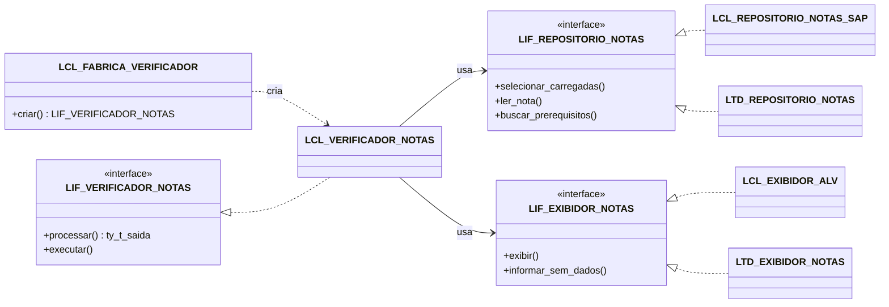
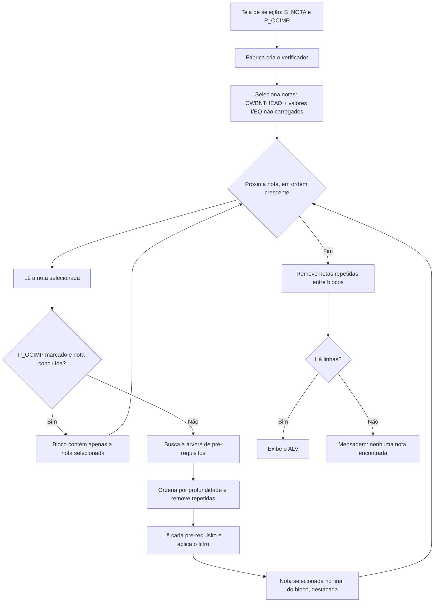

# Z_VERIF_NOTAS: Verificação de Notas SAP e da sua cadeia de pré-requisitos

Programa ABAP que recebe uma lista de Notas SAP e mostra, em uma única tela, todas as notas das quais cada uma depende, na ordem em que devem ser implementadas, junto com o status atual de cada nota no sistema.


 <!-- TODO: confirmar o status do projeto (ex.: em uso, estável, em desenvolvimento) -->
[](LICENSE)

## Sumário

- [Visão geral](#visão-geral)
- [Arquitetura](#arquitetura)
- [Tecnologias utilizadas](#tecnologias-utilizadas)
- [Estrutura do projeto](#estrutura-do-projeto)
- [Pré-requisitos e instalação](#pré-requisitos-e-instalação)
- [Exemplos de uso](#exemplos-de-uso)
- [Testes unitários](#testes-unitários)
- [Decisões técnicas](#decisões-técnicas)
- [Autor](#autor)
- [Licença](#licença)

## Visão geral

### Problema

Antes de implementar uma Nota SAP pela transação SNOTE, é preciso saber quais outras notas ela exige como pré-requisito. Essas dependências formam uma árvore: um pré-requisito pode ter seus próprios pré-requisitos. Verificar isso nota a nota, e conferir o status de cada uma, é um trabalho manual, lento e sujeito a erro, principalmente quando várias notas são analisadas ao mesmo tempo.

### Solução

O `Z_VERIF_NOTAS` automatiza essa análise. Para cada nota informada, o programa busca a árvore completa de pré-requisitos (diretos e indiretos), ordena as notas pela ordem de implementação e exibe tudo em um relatório ALV com os status de implementação e de processamento, conforme a SNOTE.

### Principais funcionalidades

- Seleção de notas por valores individuais, intervalos, padrões e exclusões.
- Inclusão de notas informadas que ainda não foram carregadas no sistema, identificadas como "Nota não carregada no sistema".
- Busca da cadeia completa de pré-requisitos de cada nota.
- Ordenação pela ordem de implementação: notas mais profundas na árvore primeiro e, em caso de empate, pelo número da nota.
- Filtro opcional para ocultar notas já concluídas. Se a própria nota selecionada estiver concluída, os pré-requisitos dela nem chegam a ser buscados.
- Remoção de notas repetidas, dentro de cada árvore e entre blocos de notas diferentes.
- Destaque em cor da nota selecionada, exibida como última linha do seu bloco.
- Cobertura por 19 testes unitários (ABAP Unit), sem acesso a banco de dados nem à tela.

## Arquitetura

O programa separa regras de negócio, acesso a dados e apresentação por meio de interfaces. As dependências são montadas por uma fábrica (padrão Factory), que pode receber dublês de teste no lugar das implementações produtivas.

| Componente | Tipo | Responsabilidade |
|---|---|---|
| `LCL_FABRICA_VERIFICADOR` | Classe (abstrata, final) | Único ponto de criação do verificador. Injeta as dependências produtivas ou as recebidas por parâmetro. |
| `LIF_VERIFICADOR_NOTAS` / `LCL_VERIFICADOR_NOTAS` | Interface / Classe | Regras de negócio: seleção, ordenação, filtros e limpeza. `CREATE PRIVATE`, instanciada só pela fábrica. |
| `LIF_REPOSITORIO_NOTAS` / `LCL_REPOSITORIO_NOTAS_SAP` | Interface / Classe | Acesso aos dados: tabela `CWBNTHEAD` e módulos de função da SNOTE. |
| `LIF_EXIBIDOR_NOTAS` / `LCL_EXIBIDOR_ALV` | Interface / Classe | Apresentação: ALV com `CL_SALV_TABLE` e mensagens de status. |
| `LCX_NOTA_NAO_ENCONTRADA` | Exceção (`CX_STATIC_CHECK`) | Sinaliza nota não carregada no sistema. |

### Relação entre os módulos



As classes `LTD_*` são dublês usados apenas nos testes unitários.

### Fluxo principal



## Tecnologias utilizadas

- **ABAP 7.50+**, com sintaxe moderna: expressões construtoras (`VALUE`, `COND`, `REDUCE`, `CONV`), declarações inline e Open SQL com variáveis de host (`@`).
- **ABAP Objects**: interfaces, classes locais, exceções baseadas em classe e `FRIENDS`.
- **SAP List Viewer (SALV)**: `CL_SALV_TABLE` para o relatório.
- **Note Assistant (SNOTE)**: tabela `CWBNTHEAD` e os módulos de função `SCWB_NOTE_READ` e `SCWB_CINST_PRECONDITION_DATA`.
- **Conversion exits**: `CONVERSION_EXIT_CWBNT_OUTPUT` e `CONVERSION_EXIT_PSTAT_OUTPUT`, que convertem os códigos de status em texto.
- **ABAP Unit**: testes unitários com dublês (stub e spy).
- **ABAP Doc**: comentários `"!` nas interfaces e métodos.

## Estrutura do projeto

O projeto é um único programa executável. Todos os componentes são objetos locais:

```text
Z_VERIF_NOTAS                     Programa executável (report)
├── Tela de seleção               S_NOTA (notas) e P_OCIMP (filtro de concluídas)
├── LCX_NOTA_NAO_ENCONTRADA       Exceção: nota não carregada no sistema
├── LIF_REPOSITORIO_NOTAS         Contrato de acesso aos dados das notas
├── LIF_VERIFICADOR_NOTAS         Contrato do verificador e tipo da linha de saída
├── LIF_EXIBIDOR_NOTAS            Contrato de apresentação do resultado
├── LCL_REPOSITORIO_NOTAS_SAP     Acesso produtivo: CWBNTHEAD e FMs SCWB_*
├── LCL_EXIBIDOR_ALV              Apresentação produtiva: CL_SALV_TABLE
├── LCL_VERIFICADOR_NOTAS         Regras de negócio
├── LCL_FABRICA_VERIFICADOR       Criação e injeção de dependências
├── START-OF-SELECTION            Validação da tela e execução
└── Testes unitários
    ├── LTD_REPOSITORIO_NOTAS     Repositório em memória com contagem de chamadas
    ├── LTD_EXIBIDOR_NOTAS        Exibidor espião (registra o que seria exibido)
    └── LTC_VERIFICADOR_NOTAS     19 casos de teste
```

Estrutura sugerida do repositório:

```text
.
├── README.md                     Esta documentação
├── z_verif_notas.abap            Código-fonte do programa
└── LICENSE                       Licença do projeto
```

<!-- TODO: confirmar nomes de arquivos e estrutura real do repositório (ex.: uso de abapGit) -->

## Pré-requisitos e instalação

### Pré-requisitos

- Sistema SAP com release ABAP 7.50 ou superior.
- Note Assistant (SNOTE) disponível, com acesso à tabela `CWBNTHEAD` e aos módulos de função `SCWB_*`.
- Permissão para criar e ativar programas no ambiente de desenvolvimento.

<!-- TODO: confirmar se a busca de pré-requisitos de notas não carregadas exige conexão do sistema com o SAP Support Portal -->

### Instalação

1. Na transação **SE38** (ou no ADT), crie o programa `Z_VERIF_NOTAS` do tipo **Programa executável**.
2. Copie o conteúdo de `z_verif_notas.abap` para o editor.
3. Crie os elementos de texto:
   - **Textos de seleção**: `S_NOTA` e `P_OCIMP`. <!-- TODO: informar os textos usados para S_NOTA e P_OCIMP -->
   - **Símbolos de texto** `B01` e `B02` (títulos dos blocos da tela), que não têm texto padrão no código. <!-- TODO: informar os títulos dos blocos B01 e B02 -->
   - Os demais símbolos (`C01` a `C15`, `H01`, `M01`, `M02`, `T01`) já têm texto padrão no próprio código e podem ser criados a partir dos literais pela comparação de símbolos de texto do editor.
4. Ative o programa.
5. (Opcional) Crie a transação `ZT_VERIF_NOTAS` na **SE93**, apontando para o programa.

### Execução

1. Execute o programa (SE38 ou transação `ZT_VERIF_NOTAS`).
2. Informe as notas em **S_NOTA**. O campo é obrigatório na prática: sem valores, o programa exibe uma mensagem e encerra.
3. Marque **P_OCIMP** para ocultar notas concluídas, se desejar.
4. Execute (F8).

| Parâmetro | Tipo | Descrição |
|---|---|---|
| `S_NOTA` | `SELECT-OPTIONS` (`CWBNTNUMM`) | Notas a verificar: valores individuais, intervalos, padrões e exclusões. |
| `P_OCIMP` | Checkbox | Oculta notas com status de implementação `A` ou status de processamento `E`. |

<!-- TODO: confirmar o significado funcional dos códigos de status 'A' (implementação) e 'E' (processamento), tratados no código como "concluído" -->

### Colunas do relatório

| Coluna | Descrição | Visibilidade |
|---|---|---|
| `NUMM` | Número da nota | Visível |
| `VERSNO` | Versão da nota | Visível |
| `THEMK` | Componente | Visível |
| `LANGU` | Idioma | Visível |
| `STEXT` | Descrição | Visível |
| `NTSTATUS` | Status de implementação (texto) | Visível |
| `PRSTATUS` | Status de processamento (texto) | Visível |
| `NOTA_PRINC` | Nota selecionada a cujo bloco a linha pertence | Oculta, disponível pelo layout |
| `NTSTATUS_COD` / `PRSTATUS_COD` | Códigos internos dos status | Técnicas (não exibidas) |

## Exemplos de uso

### Seleções típicas

| Entrada em `S_NOTA` | Resultado |
|---|---|
| Valores individuais | Cada nota é processada, mesmo que ainda não esteja carregada no sistema. |
| Intervalo (`BT`) | Processa as notas carregadas no sistema dentro do intervalo. |
| Intervalo + exclusão (`E`) | As notas excluídas não são processadas, inclusive valores individuais. |

> Intervalos amplos podem deixar a execução lenta, pois a árvore de pré-requisitos é determinada nota a nota.

### Ordem de exibição

Considere a árvore abaixo, usada nos testes unitários (as notas `100`, `200` e `300` são fictícias):

```text
100              <- nota selecionada
└── 200          <- pré-requisito direto
    └── 300      <- pré-requisito de 200
```

O relatório exibe `300`, `200` e `100`, nessa ordem: primeiro o que deve ser implementado antes. A nota `100` fecha o bloco, destacada em cor.

### Ponto de entrada

A execução se resume a validar a tela e delegar à fábrica:

```abap
START-OF-SELECTION.
  " Sem notas informadas: nada a processar
  IF s_nota[] IS INITIAL.
    MESSAGE 'Nenhuma informação passada na tela de seleção.'(m02) TYPE 'S' DISPLAY LIKE 'E'.
    RETURN.
  ENDIF.

  " A fábrica monta o verificador com as dependências produtivas
  lcl_fabrica_verificador=>criar( it_notas          = s_nota[]
                                  iv_ocultar_status = p_ocimp )->executar( ).
```

### Uso do verificador sem exibição

O método `processar` devolve as linhas de saída sem abrir o ALV, o que permite reaproveitar a lógica:

```abap
" Critério equivalente a S_NOTA
DATA(lt_notas) = VALUE lif_repositorio_notas=>ty_r_nota(
                   ( sign = 'I' option = 'EQ' low = '0000000100' ) ).

" Retorna as linhas já ordenadas, filtradas e sem repetições
DATA(lt_saida) = lcl_fabrica_verificador=>criar( it_notas = lt_notas )->processar( ).
```

## Testes unitários

A classe `LTC_VERIFICADOR_NOTAS` contém 19 testes, agrupados em:

- **Seleção**: inclusão de notas não carregadas e respeito às exclusões.
- **Ordenação e blocos**: profundidade, desempate por número, nota selecionada no final e destacada, remoção de repetidas, leitura única de cada nota, árvore vazia, referência cíclica e nota não carregada.
- **Filtro `P_OCIMP`**: ocultação por status de implementação e de processamento, filtro desligado, e nota selecionada concluída sem busca da árvore.
- **Limpeza final**: nota repetida entre blocos e transferência do destaque.
- **Execução e fábrica**: exibição do resultado, mensagem sem dados e criação da instância.

Os testes usam dublês injetados pela fábrica:

```abap
" Repositório em memória: nenhuma leitura de banco
mo_repositorio->adicionar_nota( gc_n100 ).
mo_repositorio->adicionar_nota( gc_n200 ).
mo_repositorio->adicionar_arvore(
  iv_nota = gc_n100
  it_nos  = VALUE #( ( no( iv_aleid = '1' iv_nota = gc_n100 ) )
                     ( no( iv_aleid = '2' iv_pai = '1' iv_nota = gc_n200 ) ) ) ).

" A fábrica recebe os dublês no lugar das classes produtivas
DATA(lt_saida) = lcl_fabrica_verificador=>criar( it_notas       = r_nota( gc_n100 )
                                                 io_repositorio = mo_repositorio
                                                 io_exibidor    = mo_exibidor )->processar( ).
```

Para executar: **Ctrl+Shift+F10** (Programa > Executar > Testes unitários) na SE38/SE80, ou pelo ADT.

## Decisões técnicas

### 1. Interfaces e injeção de dependências via fábrica

As regras de negócio não acessam banco nem tela diretamente; dependem apenas das interfaces `LIF_REPOSITORIO_NOTAS` e `LIF_EXIBIDOR_NOTAS`. **Por quê:** os módulos de função da SNOTE e o ALV não podem ser executados de forma previsível em testes unitários. Com a injeção, a lógica de ordenação, filtro e limpeza é testada com dados em memória, rapidamente e sem depender do estado do sistema.

### 2. Criação controlada com `CREATE PRIVATE` e `FRIENDS`

`LCL_VERIFICADOR_NOTAS` só pode ser instanciada por `LCL_FABRICA_VERIFICADOR`. **Por quê:** garante que o verificador sempre seja criado com dependências válidas e concentra em um único lugar a decisão entre implementações produtivas e dublês de teste.

### 3. Ordenação por profundidade com proteção contra ciclos

A profundidade de cada nó é calculada subindo pela cadeia de `PARENT_ALEID`, com a árvore em uma tabela ordenada pela chave do nó para leitura binária. O laço para ao atingir a quantidade de nós da árvore. **Por quê:** a nota mais profunda é a que não depende de outra dentro da árvore, portanto a que deve ser implementada primeiro. O limite evita laço infinito caso os dados retornados tenham referência cíclica, cenário coberto por teste.

### 4. Remoção de repetidas em dois momentos

As repetições são removidas na árvore, antes da leitura dos atributos, e novamente na saída final, entre blocos. **Por quê:** a primeira remoção evita chamar `SCWB_NOTE_READ` mais de uma vez para a mesma nota, o que reduz o tempo de execução. A segunda evita que um pré-requisito comum a várias notas apareça várias vezes no relatório; se a repetição removida for uma nota selecionada, o destaque em cor passa para a ocorrência mantida, para que a informação não se perca.

### 5. Filtro por código de status, não por texto

Os códigos internos ficam em colunas técnicas (`NTSTATUS_COD`, `PRSTATUS_COD`), separados dos textos exibidos. **Por quê:** os textos vêm de conversion exits e podem variar conforme o idioma de logon; o código é estável. Além disso, quando a nota selecionada já está concluída e o filtro está ativo, a árvore de pré-requisitos nem é buscada, evitando uma chamada custosa sem utilidade.

## Autor

**João Victor Ferrareis Ribeiro**, desenvolvedor SAP ABAP.

[](https://www.linkedin.com/in/joao-victor-ferrareis/)
[](https://github.com/JoaoFerrareis02)

## Licença

Este projeto está licenciado sob a [Licença MIT](LICENSE). Você pode usar, copiar, modificar e distribuir o código, desde que mantenha o aviso de copyright e a licença.
